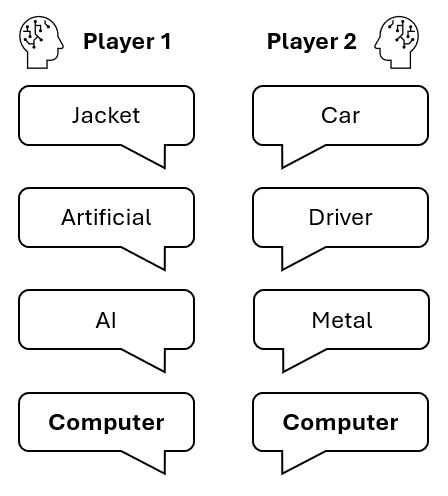

Large Language Models (LLMs) are incredible at engaging in human-like dialogue. Through tools like ChatGPT, the applications they power are truly becoming widespread in our daily lives. Lots of recent research has also aimed to make these LLMs more usable for humans, making their output more appropriate and assistive in a process called LLM alignment. However, we were curious about the reverse question: **how much do humans adapt to LLMs?**

After all, chatting with an LLM is like a social interaction with another human. We know that people **align** with each other in social interactions: they will choose to speak in similar ways, choosing similar vocabulary, syntax, and discourse strategies. It follows logically that people will also align to LLMs when interacting with them.

Now, social interaction is about much more than just the words that are spoken. Through our choice of words, we **share control** over the flow of the dialogue. This requires social cognitive abilities, such as simulating and predicting the other's utterances. So:

> **do we change our social behaviour when interacting with an LLM?**

# A simple game

To study this, we employ a simple game, which we call the **Word Synchronisation Challenge**. You can see an example here:

In this game, two players (could be people or LLMs) each have to think of a word, and reveal it to each other at the same time. Then, they repeat this process--but aim to converge on the same word, all without repeating any word that was previously used. The aim is to coneverge as fast as possible. This requires the players to coordinate: they need to simulate the other's possible word associations, in order to align.

These are all core elements of social cognition. Through this game, we can study them: measuring both the speed at which people converge, which indicates how well the players are able to align, as well as the words they choose and the relationship between them: which reveals *how* they align.

# People change their behaviour when playing with LLMs!

We recruited people on Prolific, a crowdworking platform, to play the game. They each played four games, two with another person, two with an LLM. However, in two of them, we told the participant they were playing with AI while they were actually playing with a person or vice versa.

# Paper

If you want to know more about this research, [read our paper](../../human-alignment/humanalignment_acl_crv.pdf), which will be presented at ACL 2025!

<a href="../../human-alignment/humanalignment_acl_crv.pdf" class="button">Read our paper (PDF)</a>

Feel free to get in touch if you have any other questions or want to know more! You can use any of the channels at the bottom of this page, or send an email to ruben[dot]janssens[at]ugent[dot]be.

If you use our work in any future research, please use the following citation:

~~~~
@inproceedings{cazalets2025human,
  title={Human Alignment: How Much Do We Adapt To LLMs?},
  author={Cazalets, Tanguy and Janssens, Ruben and Belpaeme, Tony and Dambre, Joni},
  booktitle={Proceedings of the 63rd Annual Meeting of the Association for Computational Linguistics},
  year={2025}
}
~~~~